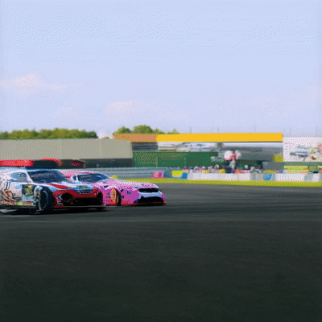

# Local AI Video Generator 🎬

Generate creative videos using artificial intelligence right from your local machine! This Streamlit application leverages the CogVideoX-5b model to transform text prompts into engaging video sequences.

<table>
  <tr>
    <td><b>Panda Jumping on Moon</b></td>
    <td><b>Cars racing on Race-track </b></td>
  </tr>
  <tr>
    <td></td>
    <td></td>
  </tr>
</table>

## 🌟 Features

- Text-to-video generation using CogVideoX-5b model
- User-friendly web interface built with Streamlit
- Adjustable video length (8 frames = 1 second of video)
- Custom random seed for reproducible results
- Supports both CPU and GPU acceleration
- Easy video download in MP4 format
- Real-time system information display

## 🛠️ Prerequisites

- Python 3.9 or higher
- CUDA-capable GPU (recommended) or CPU
- 12GB+ RAM recommended
- Windows/Linux/MacOS

## ⚙️ Installation

1. **Clone the repository**
   ```bash
   git clone https://github.com/Shivp1413/local-ai-video-generator.git
   cd local-ai-video-generator
   ```

2. **Create a virtual environment**
   ```bash
   # Windows
   python -m venv venv
   venv\Scripts\activate

   # Linux/MacOS
   python -m venv venv
   source venv/bin/activate
   ```

3. **Install required packages**
   ```bash
   pip install -r requirements.txt
   ```

## 🚀 Usage

1. **Start the application**
   ```bash
   streamlit run src/app.py
   ```

2. **Access the interface**
   - Open your web browser
   - Navigate to http://localhost:8501

3. **Generate a video**
   - Enter your creative prompt in the text area
   - Adjust the number of frames (8 frames = 1 second)
   - Set a random seed if you want reproducible results
   - Click "Generate Video" and wait for the process to complete
   - Download your video using the download button

## 📝 Example Prompts

Try these example prompts:
- "A panda playing guitar in a bamboo forest"
- "A spaceship flying through colorful nebulae"
- "A timelapse of a flower blooming in a garden"
- "A robot dancing in a futuristic city"

## ⚡ Performance Tips

1. **GPU Acceleration**
   - For optimal performance, use a CUDA-capable GPU
   - Make sure you have the latest NVIDIA drivers installed
   - The application will automatically detect and use GPU if available

2. **Memory Usage**
   - Reduce number of frames for faster generation
   - Close other memory-intensive applications
   - Monitor system resources in the sidebar

## 🔧 Troubleshooting

**Common Issues:**

1. **CUDA/GPU Issues**
   ```
   Error: Torch not compiled with CUDA enabled
   ```
   Solution: Install the CUDA-enabled version of PyTorch:
   ```bash
   pip uninstall torch
   pip install torch --index-url https://download.pytorch.org/whl/cu118
   ```

2. **Memory Issues**
   ```
   CUDA out of memory
   ```
   Solution: Reduce the number of frames or try running on CPU

3. **Model Loading Issues**
   - Check your internet connection
   - Ensure you have enough disk space
   - Try clearing your cache

## 📁 Project Structure

```
local-ai-video-generator/
├── src/
│   ├── app.py          # Main Streamlit interface
│   ├── model.py        # Model loading and configuration
│   └── utils.py        # Helper functions
├── requirements.txt    # Package dependencies
├── .gitignore         # Git ignore rules
└── README.md          # Project documentation
```

## 🤝 Contributing

Contributions are welcome! Please feel free to submit a Pull Request.

## 📄 License

This project is licensed under the MIT License - see the [LICENSE](LICENSE) file for details.

## ⭐ Show Your Support

If you find this project useful, please consider giving it a star on GitHub!

## 📧 Contact

If you have any questions or suggestions, feel free to open an issue on GitHub.

---
Happy Video Generating! 🎥✨